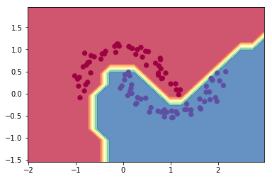

# micrograd
A tiny Autograd engine whose only dependency is NumPy. Implements backpropagation (reverse-mode autodiff) over a dynamically built DAG and a small neural networks library on top of it with a PyTorch-like API. Both are tiny.

* 24 kilobytes code without tests
* as portable as Python and NumPy
* loads 10x faster than PyTorch, 30x faster than TensorFlow

This version is capable of working with matrices and higher-order tensors. For @karpathy's original scalar-based version, locate the code with tag `scalar`.

## Installation
```bash
python3 -m venv venv
. venv/bin/activate
pip install .
```

## Get Started
```python
from micrograd import Value
from numpy import array

a = Value(array([[2, 3], [5, 4]]))
b = Value(array([1, -1]))
c = (a @ b).relu()
print(c)      # Value(data=[0 1], grad=None)
c.backward()
print(c)      # Value(data=[0 1], grad=[1. 1.])
print(a)      # Value(data=..., grad=[[0. 0.], [1. -1.]])
print(b)      # Value(data=..., grad=[5. 4.])
```

PyTorch requires any expression to be derived with respect to variables to yield a scalar. micrograd relaxes it: it starts with an all-ones tensor of the shape of the expression's result, as if rewriting the quantity to be derived as the sum of each element of the expression's original result.

## Lazy evaluation
When defining a tensor, one may just indicate `shape` and `name`, and later on provide the value.

```python
from micrograd import Value
from numpy import array

a = Value(shape=(2, 2), name='var1')
b = Value(shape=(2,), name='var2')
c = (a @ b).relu()
c.forward(var1=array([[2, 3], [5, 4]]),
          var2=array([1, -1]))
c.backward()
```

The **essential pattern** is to call `forward()` once with the values for the varialbes, then `backward()` once for the mathematical derivatives.

```python
x.forward(var1=value1, var2=value2, ...)
x.backward()
```

Each time the `forward()` is called (e.g. for minibatch evaluation), the lazily defined variables have to be fed values in the function signature. Otherwise, it will take all `nan` as value. The final result will likely be `nan` to signal missing values for some variables.

If an expression has no lazy variables at all, `forward()` call is not necessary. Once defined, the expression is evaluated.

## Efficient operator dependency topology computation
The operator dependency topology computation is only calculated once then cached, supposing the topology is static once a variable is defined.

## Supported operators
* `__pow__`
* `__matmul__`
* `tensordot` for tensor contraction: unlike numpy tensordot, the last axis (indexed by -1) of the left tensor contracts with the first axis of the right tensor; the next to last axis (indexed by -2) of the left tensor with the 2nd axis of the right tensor; so on and so forth.
* `relu`
* `log`
* `log1p`
* `tanh`
* `arctanh`
* `T` for transpose
* `sum`
* `mean`

## Training a neural net
The notebook `demo.ipynb` provides a full demo of training an 2-layer neural network (MLP) binary classifier. This is achieved by initializing a neural net from `micrograd.nn` module, implementing a simple svm "max-margin" binary classification loss and using SGD for optimization. As shown in the notebook, using a 2-layer neural net with two 16-node hidden layers we achieve the following decision boundary on the moon dataset:



## Tracing / visualization
For added convenience, the notebook `trace_graph.ipynb` produces graphviz visualizations. E.g. this one below is of a simple 2D neuron, arrived at by calling `draw_dot` on the code below, and it shows both the data (left number in each node) and the gradient (right number in each node).

```python
from micrograd import nn
n = nn.Neuron(2)
x = [Value(1.0), Value(-2.0)]
y = n(x)
dot = draw_dot(y)
```


## Running tests
The following line uses the built-in `unittest` module to run the unit tests. But to run `tests/test_vs_torch.py` it requires PyTorch. One could create a separate virtual environment for test, as PyTorch may require downgrade of NumPy to version 1.

```bash
python -m unittest tests/*.py
```

## License
MIT
