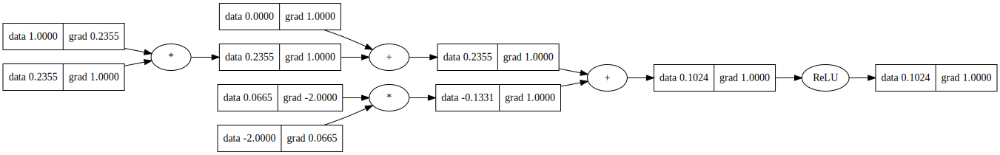

# micrograd
A tiny autograd engine whose only dependency is NumPy the linear algebra library. Micrograd implements backpropagation (automatic differentiation) over a graph of mathemtical operations.

* 20 kilobytes [core code](micrograd/engine.py), 10,000+ times smaller
* as portable as Python and NumPy
* comparable performance as industrial contenders
* code can be timed with Python's native profiler

This version works with vectors, including matrices (2-dimensional), or higher-dimensional tensors. For @karpathy's original scalar-based version, switch to the code with tag `scalar`.

## Get Started
In any working directory, create a virtual environment,

```sh
python3 -m venv venv
. venv/bin/activate
cd <directory_of_micrograd>     # if not already in the micrograd's directory
pip3 install .
cd <initial_working_directory>  # if different from micrograd
pip3 install jupyter            # for running demos in demos/
pip3 install torch              # to run tests/test_vs_torch.py
```

Below is a Python snippet. `c` is the matrix-vector product of `a` and `b`. After calling `c.backward()`, the mathematical derivatives of `c` with respect to any variable it depends on are evaluated, e.g `a.grad` is `dc/da`, `b.grad` is `dc/db`. `c.grad` is always all one as `dc/dc=1`.

```python
from micrograd import Value
from numpy import array

a = Value(array([[2, 3], [5, 4]]))
b = Value(array([1, -1]))
c = (a @ b).relu()
print(c)      # Value(data=[0 1], grad=None)
c.backward()
print(c)      # Value(data=[0 1], grad=[1. 1.])
print(a)      # Value(data=..., grad=[[0. 0.], [1. -1.]])
print(b)      # Value(data=..., grad=[5. 4.])
```

PyTorch can only mathematically derive an expression that produces a scalar value. micrograd relaxes it: if the expression produces an array, the sum of the array will be derived.

For full examples, go to [`demos/`](demos). The scalar-version [demos/demo_scalar.ipynb](demos/demo_scalar.ipynb) takes minutes to run, but the vector-version training [demos/demo_vector.ipynb](demos/demo_vector.ipynb) is instant.

## Lazy evaluation
When defining a tensor, one may just indicate `shape` and `name`, and later on provide the value corresponding to the `name`.

```python
from micrograd import Value
from numpy import array

a = Value(shape=(2, 2), name='var1')
b = Value(shape=(2,), name='var2')
c = (a @ b).relu()
c.forward(var1=array([[2, 3], [5, 4]]),
          var2=array([1, -1]))
c.backward()
```

By default, a variable awaiting value takes `nan`, if not fed any value in `forward()`. The final result will be `nan`, signalling missing values somewhere. If a mathematical expression contains no variable awaiting value, the `forward()` call is not necessary. Once defined, its value will be stored in `.data`.

## Data type
As one example, with `f=ab`, `df/da=b`. `a.grad` would inherit the data type of `b`. For this inter-dependence, we design a uniform `DTYPE` for one program, to be passed from the environment. By default `DTYPE=float64`, identical as the Python float type. For example,

```sh
DTYPE=float32 python3 <program_using_micrograd>
```

micrograd's `__init__.py` reads `DTYPE` from the environment. In Python, _before_ importing micrograd, one may manipulate the `DTYPE` by

```python
from os import environ
environ['DTYPE'] = ...

from micrograd import Value
```

One may get the `DTYPE` that micrograd read,

```python
from micrograd import DTYPE
```

## Efficient dependency graph computation
The dependency graph of mathematical operations in a mathematical expression is calculated only once then cached, **assuming** this expression is *static*, although the values of its variables may change.

## Back propogation (automatic differentiation)
If a mathematical expression `x` contains variables awaiting value, call `forward()` once to evaluate it.

Call `backward()` for mathematical differentiation of `x` with respect to the dependent variables. The `backward()` manages all initialisations of gradients: unlike PyTorch, no `zero_grad()` is necessary before `backward()`.

```python
x.forward(var1=value1, var2=value2, ...)
x.backward()
```

## Supported operators
* `__pow__`
* `__matmul__`
* `tensordot` for tensor contraction: unlike numpy tensordot, the last axis (indexed by -1) of the left tensor contracts with the first axis of the right tensor; the next to last axis (indexed by -2) of the left tensor with the 2nd axis of the right tensor; so on and so forth.
* `relu`
* `log`
* `log1p`
* `tanh`
* `arctanh`
* `T` for transpose
* `sum`
* `mean`

## Optimise by Stochastic Gradient Descent
We can minimise a mathematical expression by moving the values of its dependent variables. For example, if `x` is defined from `a` and `b`,

```python
# call x.forward() if necessary
x.backward()
a -= learning_rate * a.grad
b -= learning_rate * b.grad
```

The `micrograd.optim.SGD` wraps up the above

```python
SGD(target,   # variable to be minimised
    wrt=[],   # list of variables with respect to which
              # to perform minimisation
    learning_rate=None,
              # a non-negative number or a generator of them
    momentum=None)
```

The `learning_rate` can accept a generator implementing a schedule of varying learning rates.

Once `SGD` is created, just call `SGD.step()` with the minibatch data.

```python
optimiser = SGD(...)

for k in range(n_steps):

    # batch_iterator yields a dict
    # for the minibatch, e.g.
    #
    #  batch_data = {'X': ..,
    #                'y': ..}
    #
    batch_data = next(batch_iterator)

    optimiser.step(**batch_data)

    # validation
    validation_metric.forward()

```

## The Demos
The notebooks under `demos/` provide a full demo of training an 2-layer neural network (MLP) binary classifier. This is achieved by initializing a neural net from `micrograd.nn` module, implementing a simple svm "max-margin" binary classification loss and using SGD for optimization. As shown in the notebook, using a 2-layer neural net with two 16-node hidden layers we achieve the following decision boundary on the moon dataset:


## Tracing / visualization
For added convenience, the notebook `trace_graph.ipynb` produces graphviz visualizations. E.g. this one below is of a simple 2D neuron, arrived at by calling `draw_dot` on the code below, and it shows both the data (left number in each node) and the gradient (right number in each node).

```python
from micrograd import nn
n = nn.Neuron(2)
x = [Value(1.0), Value(-2.0)]
y = n(x)
dot = draw_dot(y)
```



## Running tests
If PyTorch requires NumPy lower than version 2, create a new virtual environment `torch`, and install downgraded NumPy there for the tests.

```sh
python3 -m venv torch
. torch/bin/activate
pip3 install "numpy<2"    # put numpy<2 inside quotation marks
                          # quotation marks here are important
```

Run the unit tests:

```sh
python -m unittest tests/*.py
```

## License
MIT
